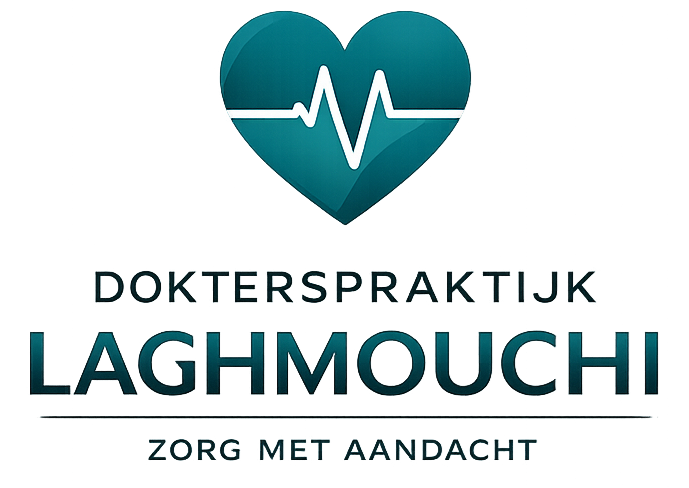

<div align="center">
  

# Dokterspraktijk Laghmouchi

**ASP.NET Core webapplicatie voor het beheren en testen van afspraken binnen een dokterspraktijk.**

</div>

---

## Inhoud

- [Projectcontext](#projectcontext)
- [Onderzoekskader](#onderzoekskader)
- [Technologieën](#technologieën)
- [Projectstructuur](#projectstructuur)
- [Teststructuur](#teststructuur)
- [Applicatie lokaal starten](#applicatie-lokaal-starten)
- [Tests uitvoeren](#tests-uitvoeren)
- [Playwright UI-tests](#playwright-ui-tests)
- [Opmerking over testdata](#opmerking-over-testdata)

---

## Projectcontext

Deze applicatie werd ontwikkeld in het kader van een bachelorproef over testautomatisering binnen een eenvoudige .NET-webapplicatie. De applicatie stelt een dokterspraktijk voor waarin een patiënt onder andere beschikbare tijdsloten kan raadplegen, een afspraak kan maken, afspraken kan bekijken en een afspraak kan annuleren.

De applicatie wordt gebruikt om klassieke xUnit-tests en Behaviour-Driven Development met Reqnroll te vergelijken op basis van testdekking en onderhoudbaarheid. Aanvullend werd een beperkte UI-testlaag toegevoegd met Playwright.

---

## Onderzoekskader

De centrale onderzoeksvraag van de bachelorproef luidt:

> In welke mate verhoogt het gebruik van Behaviour-Driven Development met Gherkin-scenario’s en stepdefinitions in Reqnroll de testdekking en onderhoudbaarheid van een eenvoudige .NET-webapplicatie in vergelijking met klassieke C#-tests met xUnit?

De applicatie dient als representatieve testcase om beide testbenaderingen op dezelfde functionele basis toe te passen.

---

## Technologieën

De belangrijkste gebruikte technologieën zijn:

- ASP.NET Core
- C#
- Razor Views
- Bootstrap 5
- Entity Framework Core
- xUnit
- Reqnroll
- Gherkin
- Playwright
- GitHub Actions
- Coverlet
- ReportGenerator

---

## Projectstructuur

De oplossing is opgebouwd volgens een Clean Architecture-benadering. Daarbij worden domeinlogica, applicatielogica, infrastructuur en webinterface van elkaar gescheiden.

```text
SlnDokterspraktijkApp
│
├── src
│   ├── Dokterspraktijk.Domain
│   ├── Dokterspraktijk.Application
│   ├── Dokterspraktijk.Infrastructure
│   └── Dokterspraktijk.WebUI
│
└── tests
    ├── Dokterspraktijk.Tests.Acceptance
    ├── Dokterspraktijk.Tests.Application
    ├── Dokterspraktijk.Tests.BDD
    └── Dokterspraktijk.Tests.xUnit
Teststructuur

De testprojecten zijn opgesplitst volgens hun doel. De Application-tests controleren de applicatielaag, terwijl de aanvullende UI-tests via Playwright de webinterface aansturen.

tests
│
├── Dokterspraktijk.Tests.Acceptance
│   └── Dokterspraktijk.Tests.Acceptance.UI
│       ├── BDD
│       │   ├── Features
│       │   │   └── AfspraakMaken.feature
│       │   ├── Hooks
│       │   │   └── PlaywrightHooks.cs
│       │   ├── StepDefinitions
│       │   │   └── AfspraakMakenStepDefinitions.cs
│       │   └── Support
│       │       └── UiTestContext.cs
│       │
│       ├── Shared
│       │   └── Pages
│       │       ├── Abstract
│       │       │   └── PageObject.cs
│       │       └── AfspraakMakenPagina.cs
│       │
│       └── xUnit
│           └── AfspraakMakenUITests.cs
│
├── Dokterspraktijk.Tests.Application
│
├── Dokterspraktijk.Tests.BDD
│   └── Dokterspraktijk.Tests.Application.BDD
│       ├── Features
│       ├── StepDefinitions
│       ├── Support
│       └── ImplicitUsings.cs
│
└── Dokterspraktijk.Tests.xUnit
    └── Dokterspraktijk.Tests.Application.xUnit
        ├── Services
        └── Support
Uitleg
Dokterspraktijk.Tests.Application.xUnit bevat de servicegerichte xUnit-tests op de applicatielaag.
Dokterspraktijk.Tests.Application.BDD bevat de servicegerichte Reqnroll-tests met Gherkin-scenario’s.
Dokterspraktijk.Tests.Acceptance.UI bevat de aanvullende Playwright UI-tests.
Binnen Dokterspraktijk.Tests.Acceptance.UI worden de BDD-UI-tests, xUnit-UI-tests en gedeelde Page Objects gescheiden gehouden.
De map Shared/Pages bevat de Page Objects die door beide UI-testvarianten hergebruikt worden.
Applicatie lokaal starten

Start de webapplicatie vanuit de hoofdmap van de oplossing:

cd C:\Users\youwa\source\repos\SlnDokterspraktijkApp
dotnet run --project .\src\Dokterspraktijk.WebUI\Dokterspraktijk.WebUI.csproj

De applicatie draait lokaal op:

http://localhost:5111

Laat dit PowerShell-venster openstaan zolang de Playwright UI-tests worden uitgevoerd.

Tests uitvoeren

Alle tests van een specifiek testproject kunnen via dotnet test worden uitgevoerd.

xUnit-tests op de applicatielaag
dotnet test .\tests\Dokterspraktijk.Tests.xUnit\Dokterspraktijk.Tests.Application.xUnit\Dokterspraktijk.Tests.Application.xUnit.csproj
Reqnroll-tests op de applicatielaag
dotnet test .\tests\Dokterspraktijk.Tests.BDD\Dokterspraktijk.Tests.Application.BDD\Dokterspraktijk.Tests.Application.BDD.csproj
Playwright UI-tests
dotnet test .\tests\Dokterspraktijk.Tests.Acceptance.UI\Dokterspraktijk.Tests.Acceptance.UI.csproj
Playwright UI-tests

Voor de aanvullende UI-testautomatisering wordt Playwright gebruikt. Deze tests openen een echte browser en voeren de afspraakflow uit via de webinterface.

De UI-testlaag bevat twee varianten:

een BDD-variant met Reqnroll, Gherkin-scenario’s en stepdefinitions;
een xUnit-variant die dezelfde UI-flow rechtstreeks in C# uitvoert.

Beide varianten gebruiken dezelfde Page Object-klasse AfspraakMakenPagina. Daardoor blijft de technische Playwright-code gecentraliseerd en moet UI-logica niet dubbel worden geschreven.

Opmerking over testdata

Bij de Playwright UI-tests moet rekening worden gehouden met testdata. Wanneer een afspraak succesvol wordt aangemaakt, wordt het gekozen tijdslot bezet. Bij een volgende testuitvoering kan hetzelfde tijdslot daardoor niet opnieuw worden gebruikt, tenzij de testafspraak uit de database verwijderd wordt of de testdata opnieuw wordt klaargezet.

Status

Dit project werd ontwikkeld als onderdeel van een bachelorproef en dient als experimentele basis voor de vergelijking tussen xUnit en Reqnroll binnen een .NET-webapplicatie.


Let erop dat je logo in je repository dan op deze plaats moet staan:

```text
src/Dokterspraktijk.WebUI/wwwroot/images/logo-volledig.png